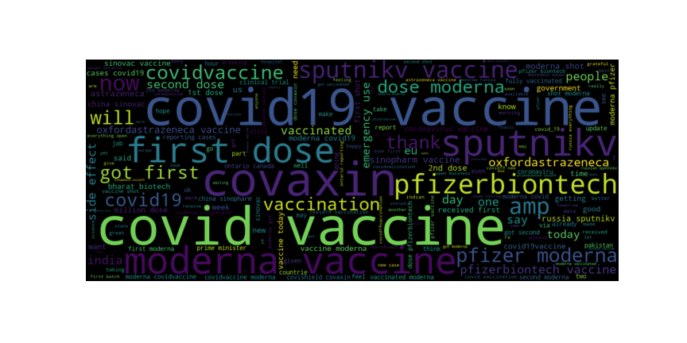

# Sentimental-analysis-of-Covid-19-vaccine-tweets

* Performed the Exploratory data analysis for the dataset from [kaggle]https://www.kaggle.com/gpreda/all-covid19-vaccines-tweets 
* Analysized correlation between different variable and remove the columns which are not required and drop the NA values in columns.
* Clean the dataset using NLP techniques foreg: removed the @(mentions), #(hashtags), https(links), removed the stop words etc
* Find out the polarity and subjectivity using the cleaned text of tweets about different vaccines.
* Visualise teh heat map.
* Analysized the source device from where the most tweets comes foreg: twitter web app, twitter for Iphone, twitter for android etc using bar plots.
* Analysized the loaction of user from which country the most tweets occurs using bar plot
* Classify the class negative, neutral and positive based on polarity between(-1, -0.01), polarity between(-0.01, 0.01),polarity between(0.01, 1) repectively.
* Tried making word clouds for the most important words or highly occured words in corpus or text.

# Bidirectional LSTM deep learning techique for training the model - sequences to vectors

accuracy - 92%

